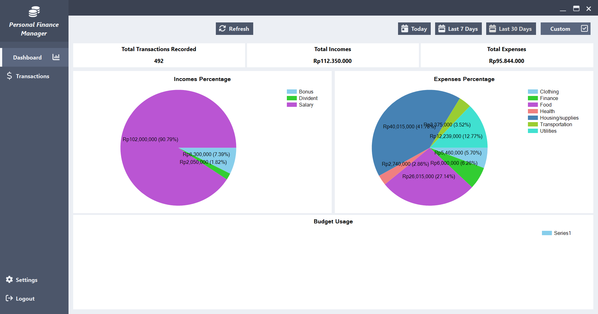

Personal Finance Manager is a simple Expense/Income manager that helps users track their finances effectively. The project handles basic CRUD (Create, Read, Update, Delete) operations for managing financial records.

This project was created as the final project for the Advanced Programming Course.